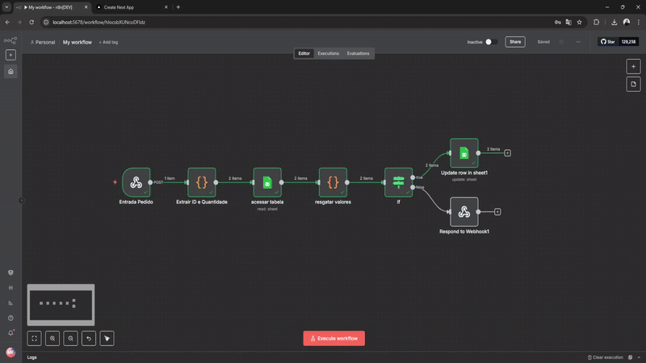

# Sistema Híbrido de Vendas e Comunicação


## Visão Geral
Este projeto foi desenvolvido para **otimizar e agilizar o processo de comunicação e vendas** em distribuidoras de diversos setores.

A solução opera em um **modelo híbrido**, permitindo que o cliente inicie uma pré-venda de forma autônoma enquanto o atendente foca em etapas estratégicas do processo de vendas.

O principal objetivo é **reduzir o tempo de espera** e **aumentar a eficiência da comunicação** entre cliente, atendente e controle de estoque.

---

## Funcionalidades Chave
- **Pré-venda Autônoma:** Clientes podem visualizar o catálogo e iniciar pedidos sem a intervenção imediata de um atendente.  
- **Automação de Fluxo:** O sistema automatiza notificações para o atendente e verifica o estoque em tempo real.  
- **Otimização de Atendimento:** O atendente recebe alertas para focar na finalização de pedidos, negociação de pagamentos e logística de envio.

---

## Processo de Automação com n8n
A automação é o **coração do sistema**, garantindo que o fluxo de dados seja contínuo e eficiente.  
Utilizamos o **n8n** para orquestrar o processo, iniciado por um webhook e executado nas seguintes etapas:



1. Um novo pedido (pré-venda) é criado na plataforma.  
2. O **n8n** recebe os dados do pedido e os processa.  
3. O estoque é verificado em tempo real através de uma API.  
4. Uma notificação automática é enviada ao atendente responsável.  
5. O status da pré-venda é atualizado na base de dados.  

---

## Detalhes de Implementação
O projeto utiliza uma combinação de ferramentas para garantir **flexibilidade e escalabilidade**.

### Ferramentas e Tecnologias
- **Frontend:** TypeScript, React e Next.js  
- **Backend:** Node.js  
- **Estilização:** Tailwind CSS, para design responsivo e eficiente  
- **Banco de Dados (Prova de Conceito):** Google Sheets  
- **Serviço de Automação:** n8n  
- **Outras APIs:** Google Drive API (para integração com Google Sheets) e API de Mensageria (para notificações)  

---

## Roadmap e Melhorias Futuras
O projeto está em constante evolução. Planejamos implementar:  
- **Interface para Atendentes:** Área dedicada para a gestão de pedidos e clientes.  
- **ID de Pedido:** Geração de um identificador único para cada pré-venda.  
- **Liberação de Estoque:** Automação para liberar produtos de pré-vendas não confirmadas após um prazo definido.  
- **Notificação por WhatsApp:** Envio automático de mensagens ao cliente após a criação da pré-venda.  

---

## Como Rodar o Projeto Localmente
Se este projeto de código-fonte for um aplicativo **Next.js**, siga estas instruções:

### 1. Clone o Repositório:
```bash
git clone https://github.com/Fernanda-Barreto/automacao-comunicacao-pre-venda.git
```

### 2. Instale as Dependências:
```bash
cd automacao-comunicacao-pre-venda
npm install
```

### 3. Configure as Variáveis de Ambiente:
Crie um arquivo `.env` na raiz do projeto e adicione as chaves necessárias (por exemplo, a chave de API do Google Drive).

### 4. Inicie o Servidor:
```bash
npm run dev
```

---


